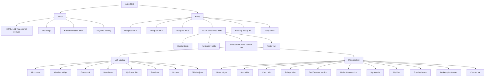
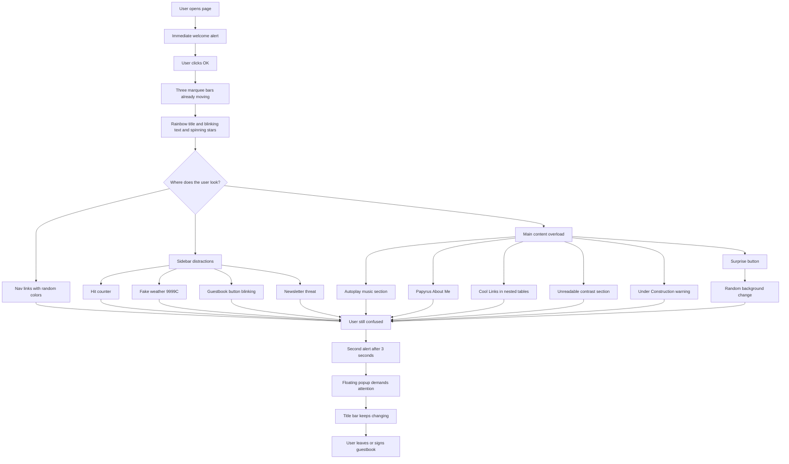
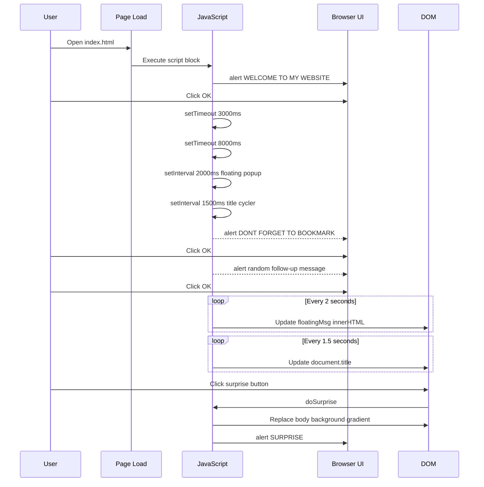
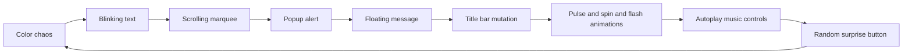

# 🌟 BEST WEBSITE HOSTED ON EARTH!

> *A satirical, single-file recreation of the spirit of [badhtml.com](http://badhtml.com) - an ironic celebration of every web design anti-pattern from 1994–2005, packed into one glorious, eye-watering page.*

[](https://best-website-hosted-on-earth.netlify.app/)
[](https://github.com/sarang-cmd/best-website-hosted-on-earth)


[](https://github.com/sarang-cmd/best-website-hosted-on-earth#-easter-eggs)

---

## Table of Contents

- [Overview](#overview)
- [Getting Started](#getting-started)
- [Why Did I Make This?](#why-did-i-make-this)
- [Easter Eggs](#-easter-eggs)
- [Design Principles](#design-principles)
  - [1. Maximum Visual Noise](#1-maximum-visual-noise)
  - [2. Typography Anarchy](#2-typography-anarchy)
  - [3. Table-Only Layout](#3-table-only-layout)
  - [4. CSS Animation for Everything](#4-css-animation-for-everything)
  - [5. Color Contrast as Anti-Pattern](#5-color-contrast-as-anti-pattern)
  - [6. Deprecated and Non-Semantic HTML](#6-deprecated-and-non-semantic-html)
  - [7. SEO Keyword Stuffing](#7-seo-keyword-stuffing)
  - [8. JavaScript as a Tool of Annoyance](#8-javascript-as-a-tool-of-annoyance)
  - [9. Inline Styles Mixed with a Stylesheet](#9-inline-styles-mixed-with-a-stylesheet)
  - [10. Copywriting Voice](#10-copywriting-voice)
- [Flowcharts](#flowcharts)
  - [Page Architecture](#page-architecture)
  - [Satirical UX Journey](#satirical-ux-journey)
  - [JavaScript Event Flow](#javascript-event-flow)
  - [Attention Hijack Loop](#attention-hijack-loop)
- [File Structure](#file-structure)
- [Sections Included](#sections-included)

---

## Overview

This project is a single-file HTML page built as a full comedic recreation of the personal homepage aesthetic that defined GeoCities, Angelfire, and Tripod between roughly 1994 and 2005.

The premise: you are a 15-year-old in 1999 who just discovered every CSS property in a single afternoon and decided to use all of them simultaneously.

Everything here is intentional. Every broken layout, every invisible text section, every unsolicited JavaScript alert - all of it is a deliberate, committed recreation of how people actually built websites before web standards existed.

---

## Getting Started

No build step. No server. No dependencies.

```bash
# Clone or download the repo, then just open the file
open index.html
```

Or drag `index.html` directly into a browser window.

> **Recommended environment:** Internet Explorer 6.0 at 800×600 resolution with Java enabled.  
> *The site may also work in Netscape 4.0. Probably. Maybe.*

---

## Why Did I Make This?

Honestly? I was bored.

The slightly longer answer: I wanted to see how far a single HTML file could go when every constraint modern web development imposes - accessibility, semantics, performance, readability, responsive design - is not just ignored but actively reversed. It's one thing to know that `<font>` tags are bad. It's another to build an entire page with them and feel why they're bad.

There's also something genuinely useful in committing to a satirical brief at full fidelity. The prompt was specific: every anti-pattern, all at once, no apologies, no winking at the camera inside the code. That's harder than it sounds. The temptation is always to leave yourself an escape hatch - a comment that says "this is intentional", a clean variable name in the JS. Resisting that and fully inhabiting the voice of a 15-year-old in 1999 who just discovered `marquee` and `blink` is its own kind of discipline.

It also just looks completely unhinged in a browser and that's funny.

---

## 🥚 Easter Eggs

Hidden details, self-referential jokes, and intentional absurdities buried throughout the source code. None of these are accidents.

---

### 1. The "CLICK HERE!!!" Nav Link

The navigation bar has eight links. Seven go to named anchors (`#about`, `#pets`, `#guestbook`, etc.). The eighth:

```html
<a href="#" onclick="alert('LOL you clicked it!! What did you expect!!! :D :D :D')"
   style="color: #ff00ff; font-size: 18px; background-color: #000000;">
  CLICK HERE!!!
</a>
```

No destination. No context. Clicking it fires an `alert()` that acknowledges it does nothing, then seems delighted about this. The link is also the largest and most visually prominent item in the nav bar.

---

### 2. The Subscriber Alert Lie

The newsletter subscribe button in the sidebar promises no spam three times in the same sentence - then immediately contradicts itself:

```html
<input type="button" value="SUBSCRIBE!!"
  onclick="alert('u have been subscribed!! We will email u EVERY DAY!!! No spam we promise!!!!')">
```

The fine print beneath it reads: *"We will email you EVERY DAY with teh latest updates!!! No spam!!! We promise!!! probably lol"*

The disclaimer quietly adds `probably lol` to the legally binding no-spam promise.

---

### 3. The Weather Widget Reports 9999°C in Dresden

The sidebar weather widget is labeled `Dresden, DE` with a temperature of `9999°C` and the message `WEATHER DATA UNAVAILABLE`. The widget exists purely to look like a weather widget while providing no weather data whatsoever. It does, however, recommend you *"call ur local weatherman"* as a fallback.

---

### 4. The Guestbook Has Zero Entries - And Knows It

```html
<i>0 entries so far... be teh FIRST!!!!</i>
```

Despite the hit counter displaying `001,337,420 visitors`, the guestbook has had zero entries since the site launched. The site has been visited over a million times by people who have all silently left.

---

### 5. The `<title>` Has Three Names

```html
<title>MY AWESOME HOMEPAGE - WELCOME - COOL SITE</title>
```

The tab title tries to be three things at once before the JavaScript title-cycler even kicks in and starts overwriting it with six more names every 1.5 seconds.

---

### 6. The Author Claims Two Identities in the Meta Tag

```html
<meta name="author" content="WebMaster2000 aka sarang">
```

The author has a professional alias (`WebMaster2000`) and a real name (`sarang`), both disclosed in the same meta tag, with `aka` in between like a criminal record.

---

### 7. The Broken Section Has Four TODO Comments - All Useless

```html
<!-- TODO add content here -->
<!-- TODO also fix teh layout -->
<!-- TODO ask mom how to do tables again -->
<!-- TODO find out what CSS is -->
```

The fourth TODO (`find out what CSS is`) is written in a file that already contains 200+ lines of CSS. The section also tells you to call `1-800-HELPME` and ask for Steve if the error persists.

---

### 8. The Copyright Starts in 1997 - The Site Was "Built in 1999"

```html
© 1997–2026 MY AWESOME WEBSITE.
```

The About Me section says "I taught myself HTML in ONE WHOLE AFTERNOON" and references Microsoft FrontPage 2000, placing construction around 1999–2000. The copyright claim backdates two years further to 1997, staking ownership of content that didn't exist yet.

---

### 9. The ICQ Number Is Exactly `88675432`

The Contact Me section lists an ICQ number: `88675432`. ICQ numbers are assigned sequentially. A number this low would have been registered in approximately 1997, when the author was allegedly 15. Either the webmaster was 13 in 1997 and has been on the internet since age 10, or the number is made up.

---

### 10. The Visitor Map Returns a 404

```
🗺️ WHO'S VISITING MY SITE
(world map loading...)
████████████████████
Please wait... loading...
Error 404: Map not found
```

The visitor map widget, which tracks where in the world your audience is coming from, cannot locate itself. It fails to load, then reports the failure inside its own loading placeholder.

---

### 11. `W3C COMPLIANT (probably)`

One of the footer award badges reads:

```
W3C COMPLIANT
(probably)
```

The page opens with `<!DOCTYPE html PUBLIC "-//W3C//DTD HTML 4.01 Transitional//EN">`, uses `<font>` tags throughout, has no `alt` on an ``, mixes deprecated and non-semantic elements freely, and embeds inline event handlers on divs. The `(probably)` is doing heavy lifting.

---

### 12. The Donate Button Says "I'm Only 15"

```html
Keep this site alive!!! Please donate!!! Hosting costs $$$!!!
Im only 15!!!
```

The donation appeal escalates from altruism (`keep this site alive`) to economics (`hosting costs $$$`) to personal vulnerability (`im only 15`) in three sentences, in a sidebar section styled entirely in red.

---

### 13. The Music Player Has No Music

```html
<audio controls autoplay loop>
  <source src="midimusic.mp3" type="audio/mpeg">
  <source src="backgroundmusic.ogg" type="audio/ogg">
</audio>
```

Both source files - `midimusic.mp3` and `backgroundmusic.ogg` - point to nonexistent local paths. The player renders, autoplays nothing, and loops the silence infinitely. The fallback message reads: *"You need to download teh plugin!!!"*

---

### 14. The `rotten.com` Link Has a Warning

The Cool Links section lists ten links. Nine of them are cheerfully annotated. The tenth:

```html
http://www.rotten.com <!-- NSFW!!! dont click if ur a baby lol :P -->
```

It is the only link on the page with a content warning, and the warning is `dont click if ur a baby lol :P`.

---

### 15. The Floating Popup Message Cycle Includes Emotional Manipulation

The seven messages that cycle through the bottom-left popup every 2 seconds escalate gradually:

```js
const floatMessages = [
  "DON'T LEAVE!! :(",
  "SUBSCRIBE TO MY NEWSLETTER!!!",
  "YOU ARE THE 1,000,000TH VISITOR!!!",
  "CLICK THE BANNER BELOW TO WIN A FREE iPod!!!",
  "SIGN MY GUESTBOOK PLZ!!! :D",
  "ADD ME ON MYSPACE!!! 💜",
  "OMG UR STILL HERE!! 😊",
  "THIS SITE IS AMAZING RIGHT?? :P"
];
```

They begin with sadness, move through false prizes, and end with the site asking for validation.


---

### 16. The Pager Number is `555-1337`

The Contact Me section lists a pager number:

```
Pager: 555-1337   beep me after 9pm plz!!!
```

`555` is the fictitious US phone prefix reserved exclusively for movies and TV shows. `1337` is leet-speak for "elite". The pager number is simultaneously fictional, untraceable, and extremely online.

---

### 17. The `` Points to a GeoCities Cat Photo That Never Existed

```html

```

No `alt` attribute. The declared dimensions are `1200×1200` shrunk to `50×50` inline. The URL points to a GeoCities path that would have 404'd even in 1999. The caption below it reads: *"picture loading... please wait... 56k modem warning!!!"* - which is accurate, because it will never finish loading.

---

### 18. The Goldfish is Named After a Pixar Film That Came Out in 2003

```
I also have 2 goldfish named BUBBLES and NEMO yes like teh movie lol!!!
```

The site's aesthetic is 1997–1999. Finding Nemo was released in 2003. The narrator casually acknowledges this (`yes like teh movie lol!!!`) without registering that it breaks the timeline entirely.

---

### 19. The About Me Section Offers Web Design Services for `$5`

Buried in the fourth paragraph of About Me:

```
IF U WANT ME TO MAKE U A WEBSITE EMAIL ME AND I WILL ONLY CHARGE $5!!!
WHAT A DEAL OMFG!!!!
```

The page you are currently looking at is the portfolio sample.

---

### 20. The Page Claims to Have Been "Last Updated: NEVER"

```
Page last updated: NEVER
```

This appears in `<font>` tags in Courier New in the footer, sandwiched between `Designed by: ME (sarang)` and `Hosted by: GeoCities (RIP)`. The site has no update history because it has never been updated. It was born complete and broken.

---

### 21. The Floating Popup Advertises a Banner That Doesn't Exist

One of the rotating messages in the bottom-left popup reads:

```
CLICK THE BANNER BELOW TO WIN A FREE iPod!!!
```

There is no banner below it. There is no banner anywhere on the page. The iPod is not attainable.

---

### 22. Three `<br><br><br>` Gaps Are Used as Section Dividers

Rather than margins, padding, or `<hr>` tags, the space between every major content section is created with raw `<br><br><br>` line breaks. This was standard practice in 1999 because nobody had explained that CSS had a `margin` property. The gaps are irregular - some sections get two breaks, some get three - creating the sensation that the page was assembled by hand with a ruler that kept slipping.

---

### 23. The HTML Comment Threatens You

```html
<!-- DO NOT STEAL MY CODE OR I WILL FIND YOU -->
```

This appears in the `<head>`, before the `<style>` block, protecting HTML that uses `<font>` tags and deprecated attributes. The threat is unconditional and the enforcement mechanism is unspecified.

---

### 24. The Footer Disclaimer Pre-Emptively Denies Owning Pokémon

```
All logos, trademarks, anime characters, pokemon, and other cool stuff
belong to their respective owners!!! Please don't sue me I have no money!!!
```

The site contains no Pokémon. It contains no anime characters. It contains no trademarks beyond its own. The disclaimer exists as a precaution against a lawsuit that could not possibly be filed.

---

### 25. The `<audio>` Element Is Set to `autoplay loop` But Has No Source

The audio section headlines itself as *"🎵 PLEASE ENJOY THE MIDI MUSIC WHILE YOU BROWSE!! 🎵"* - `autoplay` and `loop` are both set - but both `<source>` paths (`midimusic.mp3`, `backgroundmusic.ogg`) are local filenames that don't exist. The browser renders a fully functional audio control bar playing infinite silence on a loop, which may be the most accurate metaphor for the whole page.


## Design Principles

### 1. Maximum Visual Noise

Every decision prioritises stimulation over communication. The background is a `repeating-linear-gradient` cycling through five fully clashing hues - magenta, cyan, yellow, orange, and red - at a 45° angle, with a `@keyframes bgShift` animation using `hue-rotate` to shift those colors in an infinite loop.

```css
body {
  background-image: repeating-linear-gradient(
    45deg,
    #ff00ff 0px,  #ff00ff 10px,
    #00ffff 10px, #00ffff 20px,
    #ffff00 20px, #ffff00 30px,
    #ff6600 30px, #ff6600 40px,
    #ff0000 40px, #ff0000 50px
  );
  animation: bgShift 3s infinite alternate;
}

@keyframes bgShift {
  0%   { background-color: #ff00ff; filter: hue-rotate(0deg); }
  50%  { background-color: #ffff00; filter: hue-rotate(180deg); }
  100% { background-color: #ff0000; filter: hue-rotate(360deg); }
}
```

---

### 2. Typography Anarchy

Six font families appear on a single page with zero consistent sizing or color logic:

| Font | Where It Appears |
|---|---|
| `Comic Sans MS` | Navigation bar, sidebar, general body copy |
| `Papyrus` | "About Me" and "My Pets" sections |
| `Impact` | Section headings, rainbow title, floating popup |
| `Courier New` | Footer, hit counter, cool links list |
| `Arial Black` | "Cool Links" section heading |
| `Times New Roman` | Disclaimer text, footer fine print |

Section headings range from `8px` to `64px` with no consistent color or weight. The rule: nothing is allowed to feel systematic.

---

### 3. Table-Only Layout

The entire page structure - header, navigation bar, two-column content area with sidebar, and footer - is built exclusively using `<table>` elements. No flexbox. No grid. Ever.

```html
<!-- Outer wrapper -->
<table width="95%" border="5" cellpadding="10" cellspacing="3"
  style="border-color: #ff0000;">

  <!-- Header row -->
  <tr><td colspan="2"> ... </td></tr>

  <!-- Sidebar + Main Content row -->
  <tr valign="top">
    <td width="200"> <!-- sidebar --> </td>
    <td>             <!-- main content --> </td>
  </tr>

  <!-- Footer row -->
  <tr><td colspan="2"> ... </td></tr>

</table>
```

The sidebar's fixed `width="200"` deliberately breaks the layout at any viewport narrower than ~800px - exactly as intended. The "Cool Links" section nests **three `<table>` elements inside each other** to render a plain unordered list, for absolutely no structural reason.

---

### 4. CSS Animation for Everything

At least six `@keyframes` rulesets run simultaneously at any given moment:

| Animation | Element | Duration | Effect |
|---|---|---|---|
| `blink` | "WELCOME!!!" text, guestbook button | `0.7s` | `opacity` 1 → 0, simulating `<blink>` |
| `rainbowText` | Main title | `0.5s` | Cycles through full color spectrum |
| `spin` | ⭐ header stars | `1s linear` | Continuous `rotate(360deg)` |
| `pulse` | Award badges, donate/surprise buttons | `0.8s–2s` | `scale(1)` → `scale(1.3)` |
| `marqueeScroll` (×3) | Three announcement bars | `10s`, `12s`, `18s` | `translateX` scroll, different speeds so they never sync |
| `flashRed` | Under Construction warning | `0.5s` | Inverts between red-on-black and black-on-red |
| `emojiSpin` | Joke section emojis | `2s linear` | Full rotation + `scale(1.5)` at midpoint |

---

### 5. Color Contrast as Anti-Pattern

One entire section is dedicated to demonstrating zero readable contrast - three separate violations in a single `<td>`:

```html
<!-- Yellow text on white background -->
<font face="Times New Roman" color="#ffff00">
  THIS TEXT IS VERY IMPORTANT INFORMATION THAT YOU SHOULD TOTALLY READ!!!!
</font>

<!-- Red text on dark red background -->
<font face="Courier New" color="#ff0000" style="background-color: #880000">
  RED TEXT ON DARK RED BACKGROUND THIS IS ALSO VERY READABLE I THINK???
</font>

<!-- Blue text on near-black background -->
<font face="Arial" color="#0000ff" style="background-color: #000022">
  BLUE TEXT ON BLACK BACKGROUND IS VERY ELEGANT AND PROFESSIONAL!!
</font>
```

---

### 6. Deprecated and Non-Semantic HTML

The file commits fully to pre-standards markup:

- `<font face="..." size="..." color="...">` for all inline text styling
- `<center>` for alignment
- `<b>`, `<i>`, `<u>`, `<strike>` throughout body copy
- `<table>` where a `<nav>` belongs
- `<div onclick="...">` where a `<button>` belongs
- An `` with **no `alt` attribute**, declared `1200×1200px` but rendered at `width="50" height="50"` inline
- `<!DOCTYPE html PUBLIC "-//W3C//DTD HTML 4.01 Transitional//EN">` - the transitional doctype that explicitly permits loose, presentation-heavy markup

The following comment appears verbatim in the `<head>`:

```html
<!-- DO NOT STEAL MY CODE OR I WILL FIND YOU -->
```

---

### 7. SEO Keyword Stuffing

The `<meta name="keywords">` tag contains hundreds of irrelevant, era-accurate terms:

```html
<meta name="keywords" content="free, cool, awesome, best, click here, download,
mp3, games, funny, hot, 1999, geocities, angelfire, tripod, netscape,
internet explorer, java, flash, midi, warez, cracks, serial numbers,
britney spears, nsync, backstreet boys, dragonball, pokemon, y2k,
windows 98, windows xp, pentium, dial up, 56k, myspace, aim, icq,
yahoo messenger, msn, hotmail, aol, animated gif, flash intro ...">
```

Non-functional, but spiritually accurate.

---

### 8. JavaScript as a Tool of Annoyance

Three separate timed interrupts fire on page load:

```js
// Fires immediately
alert("WELCOME TO MY WEBSITE!! Please sign my guestbook and enjoy your stay!! :) :) :)");

// Fires after 3 seconds
setTimeout(() => {
  alert("DON'T FORGET TO BOOKMARK THIS PAGE!! Press CTRL+D NOW!!!!");
}, 3000);

// Fires after 8 seconds - picks a random message
setTimeout(() => {
  const msgs = [
    "OMFG ARE U STILL READING??? U MUST REALLY LOVE MY SITE!!! :D",
    "HEY!! Did u know u can email me at webmaster@myawesomehomepage.geocities.com???",
    "ROFL just wanted to check in!! How r u enjoying teh site???"
  ];
  alert(msgs[Math.floor(Math.random() * msgs.length)]);
}, 8000);
```

Two `setInterval` loops also run continuously in the background:

- **Every 1,500ms** - cycles `document.title` through six different tab titles so the browser tab is never calm
- **Every 2,000ms** - cycles the fixed bottom-left popup `<div>` through messages like `"YOU ARE THE 1,000,000TH VISITOR!!!"` and `"CLICK THE BANNER BELOW TO WIN A FREE iPod!!!"`

The **Surprise button** picks three random colors from a 15-item garish array, applies a new `repeating-linear-gradient` to `document.body.style.backgroundImage`, then fires yet another `alert()`:

```js
function doSurprise() {
  const garishColors = ['#ff00ff','#00ff00','#ff6600','#00ffff','#ff0088', ...];
  const c1 = garishColors[Math.floor(Math.random() * garishColors.length)];
  const c2 = garishColors[Math.floor(Math.random() * garishColors.length)];
  const c3 = garishColors[Math.floor(Math.random() * garishColors.length)];
  document.body.style.backgroundImage =
    `repeating-linear-gradient(45deg, ${c1} 0px, ${c1} 10px,
     ${c2} 10px, ${c2} 20px, ${c3} 20px, ${c3} 30px)`;
  alert("SURPRISE!!! LOLOL GOTCHA!!! Did u like it?? :D :D :D");
}
```

---

### 9. Inline Styles Mixed with a Stylesheet

A `<style>` block in `<head>` defines classes for animations, structural layout, and fonts. Then `style="..."` attributes on nearly every element override, duplicate, and contradict those classes. Both approaches are used on the same element throughout the file - exactly how Microsoft FrontPage 2000 generated code.

---

### 10. Copywriting Voice

All body copy follows strict 1999 internet voice rules:

- Minimum three exclamation marks per sentence (`!!!`)
- Consistent era-authentic misspellings: `teh`, `ur`, `bc`, `kewl`, `cudnt`
- Slang woven naturally into prose: `OMFG`, `LOL`, `ROFL`, `A/S/L??`, `brb`, `g2g`
- Random `ALL CAPS` paragraphs for emphasis
- Bold, italic, and underlined text combined in the same sentence for no reason
- One section written as a diary entry: *"Dear Diary, today I updated my website for teh FIRST TIME in 3 months!!!"*
- An unsolicited offer to build your website for `$5`

---
## Flowcharts

These are plain Markdown Mermaid blocks so they can be pasted directly into GitHub and rendered natively by GitHub's Mermaid integration.

### Page Architecture



### Satirical UX Journey



### JavaScript Event Flow



### Attention Hijack Loop



---


---

## File Structure

```text
index.html
├── <head>
│   ├── DOCTYPE HTML 4.01 Transitional
│   ├── <meta> keywords (stuffed)
│   ├── <meta> description, author
│   ├── <!-- DO NOT STEAL MY CODE OR I WILL FIND YOU -->
│   └── <style> (all @keyframes + class definitions)
│
└── <body>
    ├── Marquee bar 1 - "🚧 UNDER CONSTRUCTION 🚧"
    ├── Marquee bar 2 - "YOU ARE VISITOR NUMBER 000001337"
    ├── Marquee bar 3 - "BEST VIEWED IN IE 6.0"
    │
    ├── Outer <table> width="95%" border="5" (red border)
    │   ├── [Row 1] Header <table>
    │   ├── [Row 2] Navigation <table>
    │   ├── [Row 3] Sidebar + Main Content
    │   └── [Row 4] Footer
    │
    ├── Floating popup <div>
    └── <script> (alerts, intervals, surprise button)
```

---

## Sections Included

| Section | Font | Notable Feature |
|---|---|---|
| Header | Impact | 5-shadow `text-shadow`, rainbow `@keyframes`, 5 spinning stars |
| Navigation | Comic Sans | Every link a different color, one link says "CLICK HERE!!!" |
| Music Player | Impact | `<audio autoplay loop>`, dead plugin download link |
| About Me | Papyrus | Diary entry, bold+italic+underline same sentence |
| Cool Links | Courier New | Triple-nested `<table>`, raw GeoCities URLs |
| Today's Joke | Comic Sans | Spinning emoji `@keyframes`, terrible pun |
| Bad Contrast | Mixed | Yellow/white, red/darkred, blue/black - all unreadable |
| Under Construction | Impact | 80px pulsing 🚧, blinking red warning |
| My Awards | Impact | 4 fake CSS badges, pulsing `@keyframes` |
| My Pets | Comic Sans | `` no `alt`, 1200px declared → 50px rendered |
| Surprise Button | Impact | `doSurprise()` randomises background gradient |
| Broken Placeholder | Courier New | `CONTENT GOES HERE - maybe` |
| Contact Me | Arial Black | AIM, MSN, ICQ, Yahoo Messenger, Pager number |
| Sidebar | Comic Sans | Hit counter, fake weather, guestbook, newsletter, MySpace |
| Footer | Courier New | Fake world map, compat badges, `Page last updated: NEVER` |

---

*© 1997–2026 BEST WEBSITE HOSTED ON EARTH. ALL RIGHTS RESERVED. DO NOT STEAL!!!*  
*Designed by: ME (sarang) · Hosted by: GeoCities (RIP) · Made with: Microsoft FrontPage 2000 and LOVE!!!*  
*Page last updated: NEVER*
